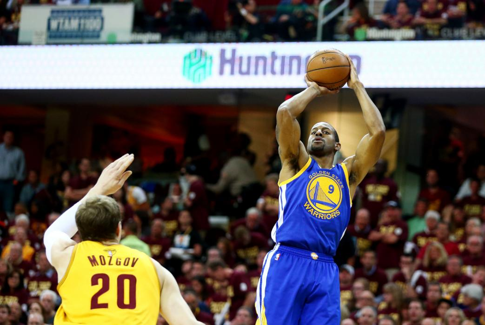
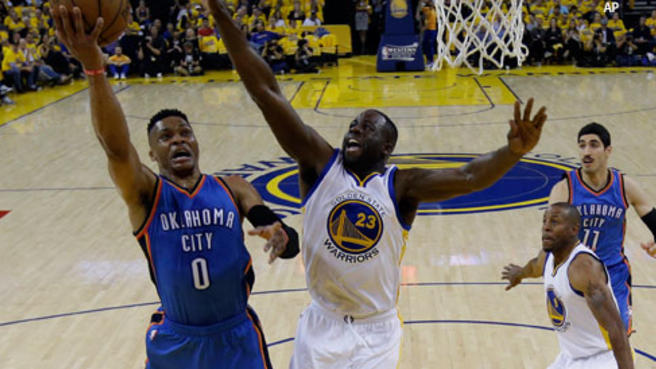
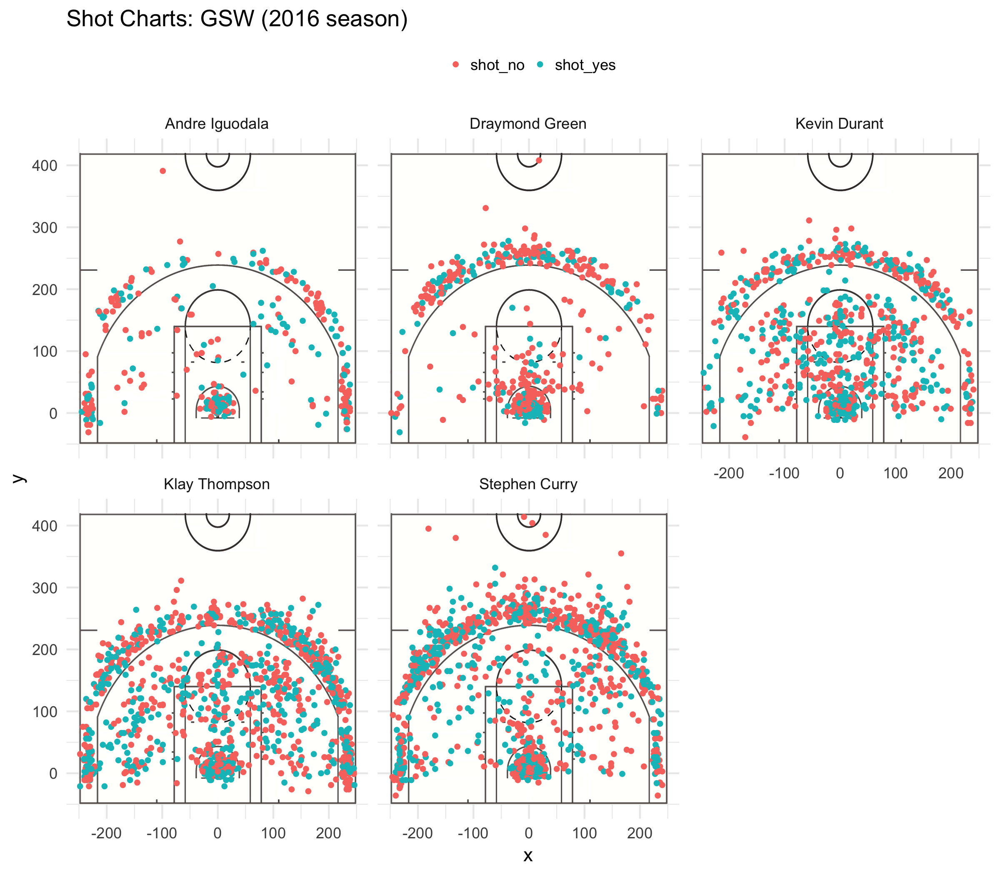

```{r setup, include=FALSE}
knitr::opts_chunk$set(echo = TRUE)
```
```{r}
library(dplyr)
```

# 5.1) Effective Shooting Percentage
```{r}
shots = read.csv("../data/shots-data.csv", stringsAsFactors = FALSE)
```

## 2PT Effective Shooting % by Player
```{r}
two_pt = shots %>% group_by(name) %>%
  filter(shot_type == '2PT Field Goal') %>%
  select(name, shot_made_flag) %>%
  summarise(
    total = length(shot_made_flag),
    made = sum(shot_made_flag == 'shot_yes')) %>%
  mutate(perc_made = 100 * made / total) %>%
  arrange(desc(perc_made))
two_pt
```

## 3PT Effective Shooting % by Player
```{r}
three_pt = shots %>% group_by(name) %>%
  filter(shot_type == '3PT Field Goal') %>%
  select(name, shot_made_flag) %>%
  summarise(
    total = length(shot_made_flag),
    made = sum(shot_made_flag == 'shot_yes')) %>%
  mutate(perc_made = 100 * made / total) %>%
  arrange(desc(perc_made))
three_pt
```

## Effective Shooting % by Player
```{r}
all_pt = shots %>% group_by(name) %>%
  select(name, shot_made_flag) %>%
  summarise(
    total = length(shot_made_flag),
    made = sum(shot_made_flag == 'shot_yes')) %>%
  mutate(perc_made = 100 * made / total) %>%
  arrange(desc(perc_made))
all_pt
```


#5.2) Narrative
### 

The 2016–17 Golden State Warriors season was magical: the Warriors won their fifth NBA Championship, setting the best postseason record in NBA history by going 16–1 in a five-game victory over Cleveland. The 16-1 run and 0.941 winning postseason percentage are league records, and the Warriors broke over 20 other NBA records as well. There were talks of a Warriors Dynasty.

The Warriors were hailed as a "Superteam" by media and fans alike, and in the center of the enormous spotlight were the "Fantastic Four," comprised of Kevin Durant, Stephen Curry, Klay Thompson and Draymond Green. Stephen Curry set numerous three-point NBA records that season, including most three-pointers made in a single game with 13 and most consecutive games (regular-season and postseason combined) with a made three-pointer with 196. Curry also surpassed 300 three-pointers in the regular-season for the second time in NBA history; he finished with 324. Draymond Green won the Defensive Player of the Year Award at the NBA Awards, the first time a Warrior has won it. Kevin Durant won the NBA Finals MVP award, the third time a Warrior has won it. The Warriors won the Team of the Year Award at the Espy Awards. Kevin Durant, Stephen Curry, Klay Thompson and Draymond Green were all named to the All-Star Game, the first time Golden State have had four All-Stars and just the eighth time in NBA history a single team has had four players in the game. The Warriors were the only team with multiple players named to the All-NBA Team this season, with Curry, Durant and Green all selected.

However, amidst the prolific achievements of Durant, Curry, Thompson, and Green, another impressively effective shooter breaks the ranks of the Fantastic Four.

While Andre Iguodala's shooting quantity pales in comparison to record-breaking superstar teammates's like Stephen Curry and Kevin Durant's, Iguodala's accuracy and effectiveness when he does shoot is an impressive feat not to be discounted.

Throughout his career, Iguodala hasn’t built a reputation as a scorer. In the 2016-17 season, he takes just `all_pt$total[all_pt$name == "Andre Iguodala"] / length(unique(shots$game_date))` = 5.23 shots per game. The most he’s averaged in a season was 15.6 per game in the 2007-08 campaign, back when he was still a member of the Philadelphia 76ers.

The 5.23 shots per game figure is remarkably lower than that of the Fantastic Four. Draymond Green, the lowest of the quartet, has still averaged `all_pt$total[all_pt$name == "Draymond Green"] / length(unique(shots$game_date))` = 8.14 shots per game. 
Kevin Durant, `all_pt$total[all_pt$name == "Kevin Durant"] / length(unique(shots$game_date))` = 12.89 shots per game, Klay Thompson `all_pt$total[all_pt$name == "Klay Thompson"] / length(unique(shots$game_date))`   = 17.18 shots per game (higher still), and Stephen Curry `all_pt$total[all_pt$name == "Stephen Curry"] / length(unique(shots$game_date))` = 17.61 (higher still).

This low stat isn't a liability for the Warriors. In fact, head coach Steve Kerr has commended Iguodala time and time again for his high basketball IQ and even compared him to his former teammate, defensive stalwart Scottie Pippen. Iguodala is an invaluable member of the Golden State Warriors, someone who defends all five positions and creates easy shots for his more celebrated teammates. Almost always in the right position, Iguodala is both an excellent defense specialist and secondary ball handler with assists that make his offensive teammates' jobs infinitely easier. 

Iguodala is definitely a well-rounded player, what is shocking, however, is how high his percentage of shots made is amidst the other members this season. Looking at the table of shots taken and made among the five, Andre Iguodala's 51.75% made is second only to Kevin Durant's success rate of 54.10%, although Durant took 2.47 times the number of shots Iguodala did, a testament to his prolific skill (Iguodala took 371 shots to Durant's 915). Thompson, Curry, and Green's stats all lie in the 40-50% range, with Green bringing up the rear with 42.39%. 

```{r, echo = FALSE}
knitr::kable(all_pt, format="html")
```

The Golden State Warriors star players have been known to force plays where there was low feasability of success, and this is readily demonstated as Thompson and Curry's shots made hover at 47% while their number shots taken surpassed 1200, dwarfing the others' figures by 300 shots at least. Iguodala's stats display his level-headedness and prudent judgment; when he does shoot, he scores points over half the time.

```{r out.width= '80%', echo = FALSE, fig.align= 'center'}

```

To break it down further, let's look only at three-point field goals. Here, Thompson, Curry, and Durant's skills are highlighted, especially Thompson and Curry's, as they both took over twice the number of shots as any of the other three and still came out with the highest percentages made, a formidable 42.41% and 40.76%, respectively.

```{r, echo = FALSE}
knitr::kable(three_pt, format="html")
knitr::kable(two_pt, format="html")
```
In regards to the two-pointers, one many be surprised to find that Andre Iguodala takes the lead in terms of accuracy at 63.81% made. In fact, excluding Draymond Green, who remains last, the ranking has turned on the its head completely. Truly, the Golden State Warriors are a team in which individual members' strengths mesh well to play impeccably.

Draymond Green has consistently placed last in accuracy of shots, but his claim to fame and what earns him a spot in the "Fantastic Four" is his defensive game. Previously winning the NBA Defensive Player of the Year Award, laying and defending multiple positions, making plays for teammates and spacing the floor are where he shines. 

```{r out.width= '80%', echo = FALSE, fig.align= 'center'}

```

However, one can see from the positions in which he chooses to shoot that he is not the most versatile shooter: looking at his shot chart, his shots are very clustered around certain areas (the three-point line and close to the hoop) and don't have the spread of those of the other members of the "Fantastic Four". This spread may indicate that they are comfortable shooting from anywhere on the court. Andre Iguodala's shot chart, though notably sparse, demonstrates that comfortable spread as well.

```{r out.width= '80%', echo = FALSE, fig.align= 'center'}

```

As the jack-of-all-trades of the Warriors, Iguodala famously provides the oil for the well-oiled machine that is the Golden State Warriors. The support he lends to his teammates is invaluable, and his conservative manner and high basketball IQ are proven to complement his more zealous teammates perfectly.
With an impressive two-pointer success rate surpassing those of his "Fantastic" teammates and overall making the shots he takes over half the time, while he is not regarded as a shooter, when he does shoot, Andre Iguodala is not a weak link by any means either.


